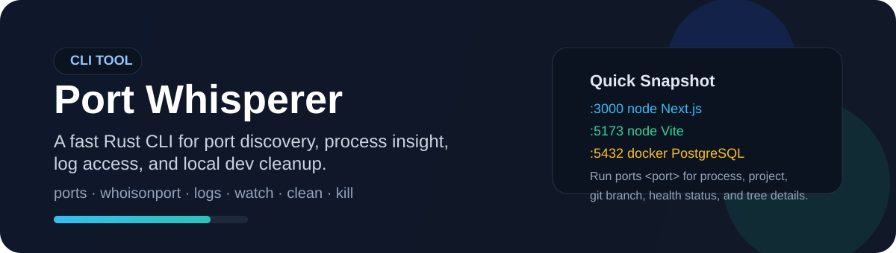

# Port Whisperer

<p align="center">
  
</p>

<p align="center">
  <strong>🔎 Discover which process owns a port, inspect runtime details, tail logs, and watch local port activity from one CLI.</strong>
</p>

<p align="center">
  
  
  
</p>

<p align="center">
  <a href="./README.zh-CN.md">🇨🇳 中文文档: README.zh-CN.md</a>
</p>

## ✨ What It Does

Port Whisperer helps you answer questions like:

- Which process is listening on this port?
- Is this a dev server, database, Docker container, or orphaned process?
- Which project folder and framework does it belong to?
- Can I inspect logs or kill it right away?

It provides two commands:

- `ports`
- `whoisonport`

`whoisonport <port>` is simply a friendly alias for `ports <port>`.

## 🚀 Installation

### npm

Install the beta channel with npm:

```bash
npm i -g ports-rs@next
```

That exposes:

```bash
ports
whoisonport
```

### Cargo

If you already use Rust:

```bash
cargo install --path .
```

### GitHub Releases

You can also download prebuilt binaries directly.

Current asset naming:

- `ports-rs-darwin-arm64.tar.gz`
- `ports-rs-darwin-x64.tar.gz`
- `ports-rs-linux-x64.tar.gz`
- `ports-rs-windows-x64.zip`

Each archive contains:

- `ports`
- `whoisonport`

Windows archives contain:

- `ports.exe`
- `whoisonport.exe`

## ⚡ Quick Start

### Show development ports

```bash
ports
```

By default, Port Whisperer focuses on development-related processes such as Node.js, Python, Java, Rust, Docker, frontend dev servers, and common local services.

### Show all listening ports

```bash
ports --all
ports -a
```

### Inspect a specific port

```bash
ports 3000
whoisonport 3000
```

Detail view includes:

- port
- process name
- PID
- health status
- framework
- memory usage
- uptime
- start time
- working directory
- project name
- git branch
- process tree

If a listener exists, the detail view can prompt to terminate it:

```text
Kill process on :3000? [y/N]
```

Only `y` or `Y` confirms the kill.

## 🧰 Commands

### Process list

```bash
ports ps
ports ps --all
ports ps -a
```

`ports ps` shows a developer-focused process table with:

- PID
- process name
- CPU%
- memory
- project
- framework
- uptime
- summarized command

### Kill listeners or processes

```bash
ports kill 3000
ports kill 3000 5173 8080
ports kill 3000-3010
ports kill 42872
ports kill --force 3000
```

Rules:

- numbers in `1..=65535` are interpreted as ports first
- if no listener is found, they fall back to PID resolution
- values above `65535` are treated as PID only
- ranges expand into multiple ports
- empty ports inside a range are summarized, not treated as hard errors

### Logs

```bash
ports logs 3000
ports logs 3000 -f
ports logs 3000 --follow
ports logs 3000 --lines 10
ports logs 3000 --lines=10
ports logs 3000 --err
```

Port Whisperer tries to discover:

- redirected stdout/stderr files
- `.log` / `logs/` / `nohup.out` style paths
- system log fallbacks on macOS, Linux, and Windows

### Clean orphaned or zombie processes

```bash
ports clean
```

### Watch port changes

```bash
ports watch
```

Press `Ctrl+C` to stop.

## 🧱 Tech Stack

| Layer | Tech |
| --- | --- |
| Core CLI | Rust |
| Packaging | npm + Node.js install scripts |
| macOS process discovery | `lsof` + `ps` + `log` |
| Linux process discovery | `/proc` + `ss` / `netstat` + `ps` + `journalctl` |
| Windows process discovery | `netstat` + `wmic` / PowerShell + `taskkill` |

## 📊 Performance

Fresh local measurements:

| Command | Node avg | Rust avg |
| --- | ---: | ---: |
| `ports` | `0.46s` | `0.19s` |
| `ports --all` | `0.45s` | `0.18s` |
| `ports ps` | `0.15s` | `0.10s` |
| `ports <port>` | `7.20s` | `0.09s` |

These figures come from fresh local runs on the current development machine. Exact timings will vary by OS, hardware, background processes, and Docker state.

## 🖥️ Platform Support

Current target release platforms:

- macOS arm64
- macOS x64
- Linux x64
- Windows x64

## 🔗 Reference

This Rust rewrite is based on the original project:

- [LarsenCundric/port-whisperer](https://github.com/LarsenCundric/port-whisperer)

The goal of this repository is to preserve the core CLI workflow and user-facing behavior while rebuilding the implementation in Rust.

## ❓ FAQ

### What is `whoisonport`?

It is just an alias for:

```bash
ports <port>
```

### npm install failed. What now?

You can:

1. download the matching binary from GitHub Releases manually
2. install directly from source:

```bash
cargo install --path .
```

### Why are some fields empty?

Directory, project, framework, and git branch information depend on system visibility, permissions, cwd discovery, and project-root detection. Some system or sandboxed processes cannot expose all metadata.

### Why doesn't the default view show every port?

The default `ports` command is intentionally filtered for development-related processes. Use:

```bash
ports --all
```

to see everything.

## 🔧 Development

```bash
cargo build
cargo test
```

Run locally:

```bash
cargo run --bin ports
cargo run --bin whoisonport -- 3000
```

## 📄 License

[MIT](LICENSE)
