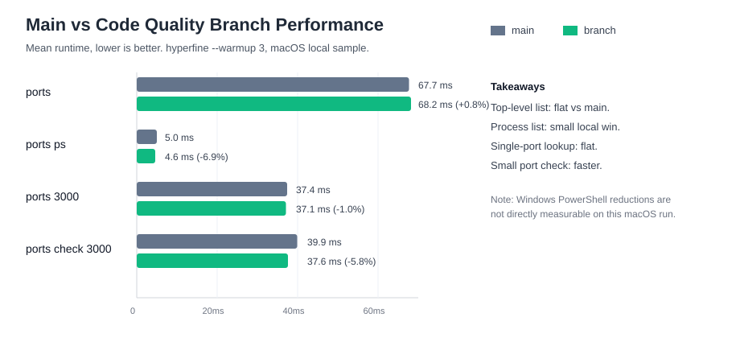

# Main vs Code Quality Branch Performance

## Purpose

This document records a local release-mode benchmark comparing `main` with the current `fix/code-quality-improvements` branch after the Windows and small-port-check performance work. It follows the existing benchmark convention in this repository: release binaries measured with `hyperfine --warmup 3`.

## Measurement Context

- Date: `2026-04-28`
- Baseline branch: `main`
- Baseline commit: `04d7527709764650d0b450c3e638c62e3f279e93`
- Candidate branch: `fix/code-quality-improvements`
- Candidate commit: `d576a613b141d973dbe1d4fb0b6c00b3111a016d`
- Baseline binary: `/tmp/port-whisperer-bench-main-20260428/target/release/ports`
- Candidate binary: `./target/release/ports`
- Tool: `hyperfine 1.19.0`
- Warmup: `3 runs`
- Rust compiler: `rustc 1.95.0 (59807616e 2026-04-14)`
- Cargo: `cargo 1.95.0 (f2d3ce0bd 2026-03-21)`
- OS: `Darwin EasyMacBook-Pro.local 25.4.0 Darwin Kernel Version 25.4.0: Thu Mar 19 19:30:44 PDT 2026; root:xnu-12377.101.15~1/RELEASE_ARM64_T6000 arm64`
- Port 3000 state: no listener was present during the benchmark.

## Commands

Both branches were built in release mode before measurement:

```sh
cargo build --release
cargo build --release
```

The first build command was run in the candidate checkout. The second was run in a detached `main` worktree at `/tmp/port-whisperer-bench-main-20260428`.

Steady-state timing was captured with:

```sh
hyperfine --warmup 3 \
  --command-name 'main ports' '/tmp/port-whisperer-bench-main-20260428/target/release/ports' \
  --command-name 'branch ports' './target/release/ports' \
  --command-name 'main ports ps' '/tmp/port-whisperer-bench-main-20260428/target/release/ports ps' \
  --command-name 'branch ports ps' './target/release/ports ps' \
  --command-name 'main ports 3000' '/tmp/port-whisperer-bench-main-20260428/target/release/ports 3000' \
  --command-name 'branch ports 3000' './target/release/ports 3000' \
  --command-name 'main ports check 3000' '/tmp/port-whisperer-bench-main-20260428/target/release/ports check 3000' \
  --command-name 'branch ports check 3000' './target/release/ports check 3000'
```

## Results



| Command | Main Mean | Branch Mean | Delta | Change | Main Std. Dev. | Branch Std. Dev. | Runs |
| --- | ---: | ---: | ---: | ---: | ---: | ---: | ---: |
| `ports` | 67.7 ms | 68.2 ms | +0.5 ms | +0.8% | 1.0 ms | 2.1 ms | 41 / 42 |
| `ports ps` | 5.0 ms | 4.6 ms | -0.3 ms | -6.9% | 0.9 ms | 0.5 ms | 296 / 325 |
| `ports 3000` | 37.4 ms | 37.1 ms | -0.4 ms | -1.0% | 3.9 ms | 1.8 ms | 74 / 71 |
| `ports check 3000` | 39.9 ms | 37.6 ms | -2.3 ms | -5.8% | 2.2 ms | 3.8 ms | 64 / 70 |

## Interpretation

- The top-level `ports` command is effectively flat compared with `main`; the `+0.8%` change is inside local measurement noise.
- `ports ps` is faster by roughly `6.9%`, though hyperfine warned that sub-5ms commands are close to shell calibration limits.
- `ports 3000` is effectively flat, with a small `1.0%` improvement on this local sample.
- `ports check 3000` improves by roughly `5.8%`, matching the targeted small-port-check optimization.
- The largest performance work in this branch is Windows-specific process probing and single-port lookup behavior. This local benchmark was run on macOS, so it validates no macOS regression and the small-check path, but it cannot directly measure the Windows PowerShell-startup reduction.

## Notes

- Hyperfine reported statistical outliers on several commands. Treat these numbers as a local sample, not a universal timing guarantee.
- `ports ps` completed near or below hyperfine's 5ms shell calibration threshold, so its percentage improvement should be read cautiously.
- CI for the candidate commit passed on macOS, Ubuntu, Windows, and Node package verification.
